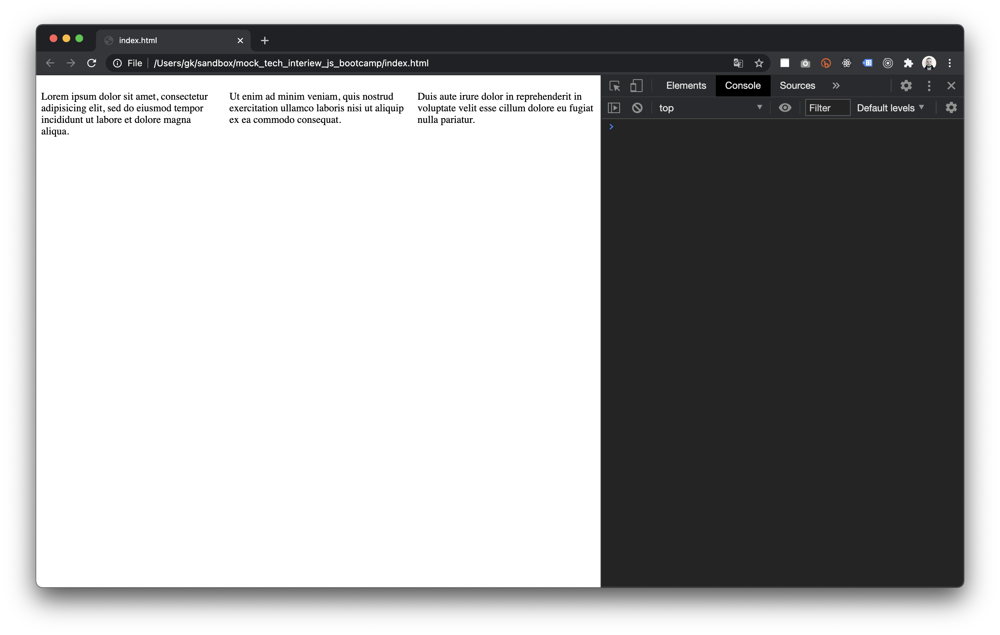
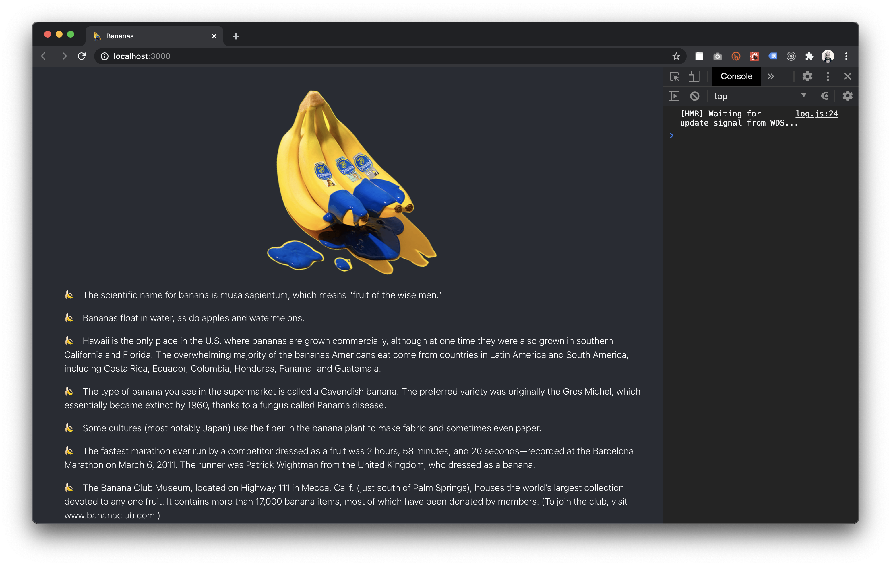

# HTML

If there is, please fix it and commit changes.

```html
<!DOCTYPE html>
<html>
<head>
	<meta charset="UTF-8">
    <meta http-equiv="X-UA-Compatible" content="IE=edge">
    <meta name="viewport" content="width=device-width, initial-scale=1.0">
	<title>Mega lorem</title>
</head>
	<body>
		<div>
			<main>
				<h1>Lorem ipsum</h1>
				<section>
					<p>Lorem ipsum dolor sit amet, consectetur adipisicing elit, sed do eiusmod</p>
						
						<p>Lorem ipsum dolor sit amet</p>
						<ul>
							<li>Lorem 1</li>
							<li>Lorem 2</li>
						</ul>
					</section>
				</p>
			</div>
		</main>
	</body>
</html>
```

# CSS

## 01. How can we achieve these results with CSS for the following HTML code? If you know several ways please write all of them. / 5-10 minutes

```html
<article>
  <p>
    Lorem ipsum dolor sit amet, consectetur adipisicing elit, sed do eiusmod
    tempor incididunt ut labore et dolore magna aliqua.
  </p>
  <p>
    Ut enim ad minim veniam, quis nostrud exercitation ullamco laboris nisi ut
    aliquip ex ea commodo consequat.
  </p>
  <p>
    Duis aute irure dolor in reprehenderit in voluptate velit esse cillum dolore
    eu fugiat nulla pariatur.
  </p>
</article>
```

```css
article {
  height: 30vh;
  width: 100vw;
  background: linear-gradient(45deg, #f902db, aqua);
  display: flex;
  justify-content: space-between;
}
```

```css
article {
  height: 30vh;
  width: 100vw;
  background: linear-gradient(45deg, #f902db, aqua);
  grid-template-columns: repeat(3, minmax(0, 1fr));
}
```



## 02. You need to vertically center this text inside the gradient container. What would be your approach? / 5 minutes


```html
<article class="two">
  <p>I should be in the middle</p>
</article>
```

```css
article {
  height: 30vh;
  width: 100vw;
  background: linear-gradient(45deg, #f902db, aqua);
  align-items: center;
  justify-content: center;
}
```

# JavaScript

## 01. Is it possible to rewrite this function so it will still give the same output but will not have `return` keyword in it? / 5 minutes

```js
function add(num1, num2) {
	add(num1, num2) = num1 + num2;
}
```

## 02. Which ways do you know to make sure that this function is not returning NaN if one or both arguments are not provided but instead treats missing argument(s) as zeros? / 5 minutes

```js
function add(num1, num2) {
  return (num1 || 0) + (num2 || 0);
}
```

## 03. What would be the output of this function? Why? / 5 minutes

```js
let lookingForTwo = (a) => {
  return a.forEach((n) => (n === 2 ? "ok" : "not 2"));
};
lookingForTwo([1, 2, 3]);
```

The output of this function would be undefined. The forEach() method is used to execute a provided function once
for each array element. It doesn't return a value but it will execute the provided function. The values retured by this function
are not being used in any way. Since the return value of the function is ignored, the messages are not visible.

## 04. If using `fetch` you have the following **products.json**, how would you print the total cost of these 3 products in the most efficient way / < 10 minutes

```js
fetch('./products.json')
	.then(response => response.json())
	.then(data => {
		let totalCost = data.products.reduce((acc, val) => acc + val.price, 0);
		return totalCost;
	})
	.catch(err => console.error(err));


# React

## 03. Fix all the possible errors/warnings in the code from the fix_react folder and publish it online in any way you prefer. / 15 minutes



# Backend

## 03. Create a server with only one route sending as a response current timestamp in a string like this / 5-10 minutes:

`Current time is Mon Jan 09 2023 13:26:25 GMT+0100 (Central European Standard Time)`
```
